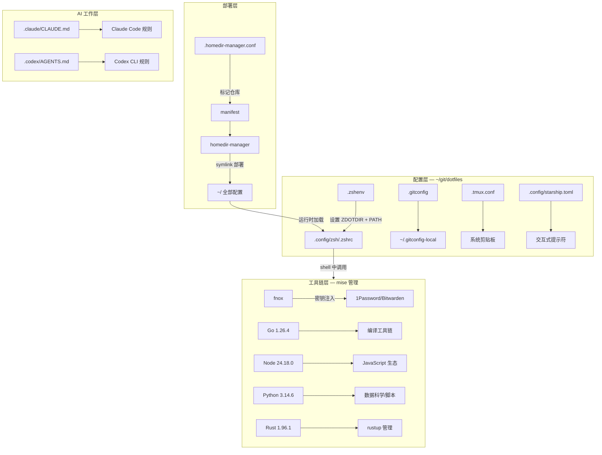
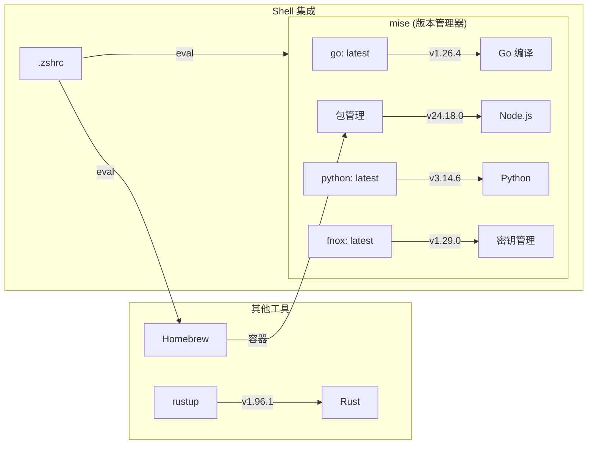
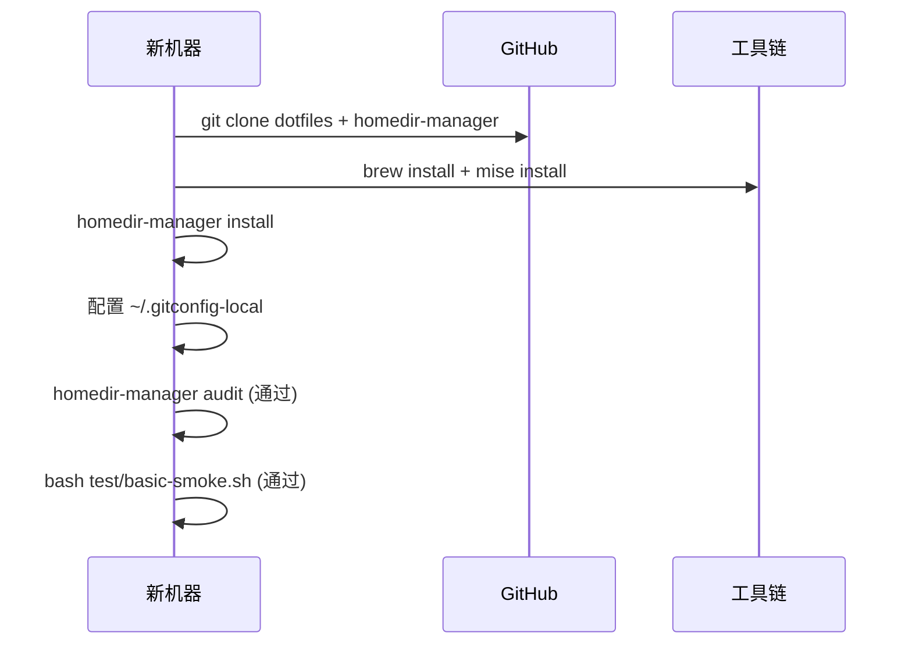
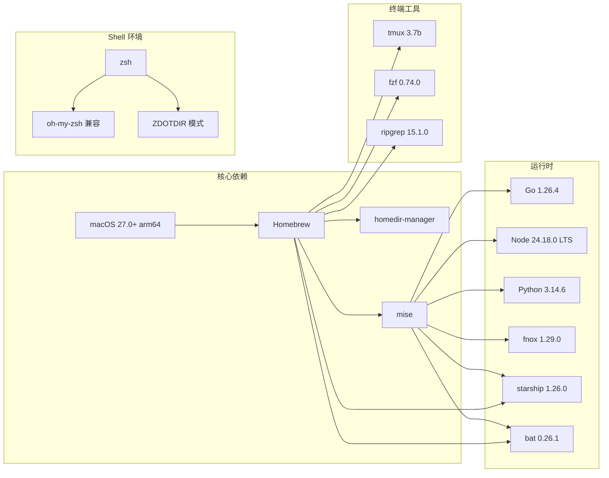

# dotfiles 用户手册

> **版本**: 1.0.0 | **最后更新**: 2026-07-08 | **维护者**: Guoqin Chen
> **仓库**: [github.com/guoqinchen/dotfiles](https://github.com/guoqinchen/dotfiles)
> **部署引擎**: [homedir-manager](https://github.com/obra/homedir-manager)

---

## 目录

1. [产品概述](#1-产品概述)
2. [系统架构](#2-系统架构)
3. [功能特性](#3-功能特性)
4. [快速上手](#4-快速上手)
5. [详细操作指南](#5-详细操作指南)
6. [工具链说明](#6-工具链说明)
7. [日常维护](#7-日常维护)
8. [常见问题解答](#8-常见问题解答)
9. [注意事项](#9-注意事项)
10. [附录](#10-附录)

---

## 1. 产品概述

### 1.1 产品定位

dotfiles 是一套 **macOS 全栈开发环境配置管理系统**。它通过 [homedir-manager](https://github.com/obra/homedir-manager) 引擎将全部开发者配置文件（shell、编辑器、Git、终端等）集中纳入 Git 版本管理，实现 **一处修改、处处同步**。

### 1.2 适用范围

| 维度 | 说明 |
|------|------|
| 操作系统 | macOS 27.0+ (arm64)；部分配置兼容 Linux |
| 用户角色 | 全栈开发者、AI 辅助开发者 |
| 核心技能 | 熟悉终端操作、Git 基础 |
| 适用场景 | 新机快速部署、多机环境同步、配置版本追溯、AI 工作流集成 |

### 1.3 设计理念

- **不复制，不粘贴** — 提取业界最佳实践的模式而非直接复制他人配置
- **幂等部署** — 重复运行 `homedir-manager install` 不会产生副作用
- **秘密不入仓** — 密钥/Token/凭据通过 `fnox` 管理，永不进入 Git 仓库
- **AI 原生** — 内置 `CLAUDE.md` / `AGENTS.md`，AI 编码助手开箱即理解环境

---

## 2. 系统架构



---

## 3. 功能特性

### 3.1 核心功能清单

| 功能 | 说明 | 涉及文件 |
|------|------|---------|
| **ZDOTDIR 模式** | zsh 配置从 `~/.config/zsh/` 加载，防止 IDE 覆盖 | `.zshenv`, `.config/zsh/.zshrc` |
| **Git 配置分离** | 用户身份存于 `~/.gitconfig-local`，不入仓 | `.gitconfig`, `~/.gitconfig-local` |
| **版本管理统一** | Go/Node/Python/Java/Maven/fnox 由 mise 管理，Rust 由 rustup | `.config/mise/config.toml` |
| **密钥管理** | fnox 按需加载密钥，`audit --secrets` 防泄漏 | 系统级 `~/.config/fnox/config.toml` |
| **安全推送** | pre-push hook 自动审计密钥后阻止危险推送 | `hooks/pre-push` |
| **终端增强** | Ghostty 1.3 (GPU) + tmux + starship + fzf + bat | `.tmux.conf`, `.config/ghostty/config`, `.config/starship.toml` |
| **容器环境** | Docker 29 + Docker Compose 5（Colima + Lima VM） | `.colima/default/colima.yaml` |
| **AI 集成** | Claude Code / Codex CLI 感知开发环境 | `.claude/CLAUDE.md`, `.codex/AGENTS.md` |
| **一键同步** | `dotfiles-sync` 完成审计、提交、推送 | `bin/dotfiles-sync` |
| **部署验证** | `test/basic-smoke.sh` 烟雾测试 | `test/basic-smoke.sh` |
| **窗口管理** | Hammerspoon 快捷键分屏 | `.hammerspoon/init.lua` |

### 3.2 托管配置清单

共 **18 项**配置通过 `manifest` 管理（截止 v1.0.0）：

**Shell 层 (5 项)**
| 部署路径 | 说明 |
|---------|------|
| `~/.zshenv` | ZDOTDIR 设置 + PATH 注入 |
| `~/.config/zsh/.zshrc` | 主交互式 shell 配置 |
| `~/.config/zsh/.zprofile` | 登录 shell 配置 |
| `~/.config/zsh/macos.zsh` | macOS 专有配置 |
| `~/.config/zsh/linux.zsh` | Linux 专有配置（占位） |

**Git 层 (2 项)**
| 部署路径 | 说明 |
|---------|------|
| `~/.gitconfig` | 通用 git 配置（不含身份） |
| `~/.config/git/ignore` | 全局 git 忽略规则 |

**终端层 (2 项)**
| 部署路径 | 说明 |
|---------|------|
| `~/.tmux.conf` | tmux 配置（Ctrl-b 前缀 + 系统剪贴板） |
| `~/.config/ghostty/config` | Ghostty 终端模拟器配置 |

**CLI 工具层 (3 项)**
| 部署路径 | 说明 |
|---------|------|
| `~/.config/mise/config.toml` | 工具版本声明 |
| `~/.config/starship.toml` | 交互式提示符 |
| `~/.colima/default/colima.yaml` | Colima 容器 VM 配置 |

**AI 层 (2 项)**
| 部署路径 | 说明 |
|---------|------|
| `~/.claude/CLAUDE.md` | Claude Code Agent 行为规则 |
| `~/.codex/AGENTS.md` | Codex CLI Agent 行为规则 |

**脚本与测试 (2 项)**
| 部署路径 | 说明 |
|---------|------|
| `~/bin/dotfiles-sync` | 一键同步脚本 |
| `~/test/basic-smoke.sh` | 烟雾测试 |

**应用配置 (1 项)**
| 部署路径 | 说明 |
|---------|------|
| `~/Library/Application Support/Trae CN/User/settings.json` | Trae IDE 设置 |

---

## 4. 快速上手

### 4.1 新机器 bootstrap（5 分钟）

```bash
# 1. 安装基础工具
xcode-select --install                          # Xcode CLI tools
/bin/bash -c "$(curl -fsSL https://raw.githubusercontent.com/Homebrew/install/HEAD/install.sh)"

# 2. 克隆仓库和引擎
git clone https://github.com/guoqinchen/dotfiles ~/git/dotfiles
git clone https://github.com/obra/homedir-manager ~/git/homedir-manager
~/git/homedir-manager/bootstrap

# 3. 安装工具并部署
brew install git gh tmux ripgrep fd fzf jq bat starship mise ghostty
# rtk（可选，LLM token 优化）
curl -fsSL https://raw.githubusercontent.com/rtk-ai/rtk/master/install.sh | sh
homedir-manager install

# 4. 安装语言运行时
eval "$(mise activate bash)"
mise install

# 5. 配置身份 (手动)
vim ~/.gitconfig-local          # 写入 user.name + user.email
chmod 600 ~/.gitconfig-local

# 6. 验证
homedir-manager audit
bash ~/test/basic-smoke.sh
```

### 4.2 每日工作流

```bash
# 修改配置（文件已被 symlink 到仓库）
vim ~/.tmux.conf

# 一键同步
dotfiles-sync "调整 tmux 颜色方案"

# 验证
homedir-manager audit --secrets
```

---

## 5. 详细操作指南

### 5.1 修改现有配置

dotfiles 的设计哲学是 **"编辑即修改"**——所有配置文件是仓库的符号链接：

```
~/.tmux.conf ──symlink──→ ~/git/dotfiles/.tmux.conf ──tracked──→ Git
```

操作步骤：
```bash
# 1. 直接编辑（因为这是 symlink）
vim ~/.tmux.conf

# 2. 查看变更
cd ~/git/dotfiles
git diff

# 3. 提交
dotfiles-sync "feat: 调整状态栏颜色"
```

### 5.2 添加新配置文件

```bash
# 1. 将文件复制到仓库
cp ~/.config/new-tool.toml ~/git/dotfiles/.config/new-tool.toml

# 2. 加入 manifest
echo ".config/new-tool.toml" >> ~/git/dotfiles/manifest

# 3. 部署
homedir-manager install

# 4. 验证
ls -la ~/.config/new-tool.toml       # 应为 symlink
```

### 5.3 管理 Node 版本

```bash
# 设置全局默认版本（lts）
mise use -g node@lts

# 项目级版本：在项目根目录创建 .mise.toml
cd ~/projects/myapp
cat > .mise.toml << 'EOF'
[tools]
node = "18"
EOF

# 临时切换
mise use node@20

# 查看当前版本
node --version
```

### 5.4 管理密钥

```bash
# 初始化 fnox（首次使用）
mise use -g fnox@latest
fnox init

# 存储密钥
fnox set GITHUB_TOKEN "ghp_xxxxxxxxxxxx"

# 使用密钥
fnox exec -- gh repo list

# 查看已存储的密钥
fnox list
```

### 5.5 运行诊断

```bash
# 检查 symlink 完整性
homedir-manager audit

# 检查密钥泄漏 + 文件权限
homedir-manager audit --secrets

# 运行烟雾测试
bash ~/test/basic-smoke.sh

# 一键同步（含前置审计 + 钩子安装）
dotfiles-sync
```

---

## 6. 工具链说明

### 6.1 版本管理工具一览



### 6.2 安装路径速查

| 工具 | 二进制路径 | 数据目录 |
|------|-----------|---------|
| Node | `~/.local/share/mise/installs/node/lts/bin/node` | 同上 |
| Go | `~/.local/share/mise/installs/go/1.26.4/bin/go` | `~/go/` |
| Python | `~/.local/share/mise/installs/python/latest/bin/python3` | 同 Node |
| Java | `~/.local/share/mise/installs/java/21.0.2/bin/java` | `~/.local/share/mise/installs/java/` |
| Maven | `~/.local/share/mise/installs/maven/latest/apache-maven-3.9.16/bin/mvn` | 同上 |
| fnox | `~/.local/share/mise/installs/fnox/latest/fnox` | `~/.config/fnox/` |
| Rust | `~/.cargo/bin/rustc` | `~/.cargo/`, `~/.rustup/` |

### 6.3 Homebrew 已安装工具

```
bat         colima          docker          fd          gh
ghostty     hammerspoon     htop            icdiff      jq
lima        mas             mise            ripgrep     starship
tmux        tree            wget            docker-compose
```

---

## 7. 日常维护

### 7.1 建议维护计划

| 频率 | 任务 | 命令 |
|------|------|------|
| **每日** | 同步配置 | `dotfiles-sync` |
| **每周** | 完整性审计 | `homedir-manager audit` |
| **每月** | 安全审计 | `homedir-manager audit --secrets` |
| **每月** | 系统更新 | `brew update && brew upgrade` |
| **每季度** | mise 版本更新 | `mise upgrade` |
| **每季度** | 清理无用 brew 包 | `brew cleanup` |

### 7.2 Git 钩子维护

pre-push hook 自动审计密钥文件权限：

```bash
# hook 位于仓库 hooks/pre-push
# dotfiles-sync 每次运行自动同步到 .git/hooks/pre-push
# 如手动激活：
cp ~/git/dotfiles/hooks/pre-push ~/git/dotfiles/.git/hooks/pre-push
chmod +x ~/git/dotfiles/.git/hooks/pre-push
```

### 7.3 新增机器工作流



---

## 8. 常见问题解答

### 8.1 ZDOTDIR 相关

**Q: 设置 ZDOTDIR 后，终端报错找不到 .zshrc？**
A: 执行 `exec zsh -l` 或重启终端应用。`~/.zshenv` 已设置 `ZDOTDIR`，但当前会话未重新加载。

**Q: Trae IDE 内置终端不加载自定义配置？**
A: 在 Trae `settings.json` 中添加：
```json
"terminal.integrated.env.osx": {
  "ZDOTDIR": "$HOME/.config/zsh"
}
```

**Q: `sudo` 后配置不生效？**
A: `sudo` 使用 root 用户环境，不加载 `~/.zshenv`。可在 `/etc/zshrc` 中添加 `source` 语句指向你的配置。

### 8.2 密钥管理

**Q: `homedir-manager audit --secrets` 报错权限问题？**
A: 运行 `chmod 600 ~/.gitconfig-local ~/.config/fnox/config.toml`。审计要求密钥文件为 600 权限。

**Q: fnox 提示登录过期？**
A: 重新登录密码管理器：`op signin`(1Password) 或 `rbw unlock`(Bitwarden)。

### 8.3 工具链

**Q: `which node` 显示多个路径？**
A: 运行 `eval "$(mise activate bash)" && mise use -g node@lts` 确保 mise 接管。检查 `echo $PATH` 中 mise 路径排在首位。

**Q: `rustc` 命令找不到？**
A: Rust 通过 rustup 管理，首次安装需：
```bash
curl --proto '=https' --tlsv1.2 -sSf https://sh.rustup.rs | sh
```
安装后执行 `source ~/.cargo/env`。

### 8.4 部署问题

**Q: `homedir-manager install` 报 `symlink: File exists`？**
A: 引擎自动备份冲突文件到 `~/.dotfiles-backup/<timestamp>/`，无需手动干预。

**Q: `dotfiles-sync` 报 `command not found`？**
A: `~/bin` 需要加入 PATH。运行 `exec zsh -l` 重新加载 `.zshenv`，或手动 `export PATH="$HOME/bin:$PATH"`。

### 8.5 shell 相关

**Q: 命令加 `#` 注释时报 `zsh: bad pattern`？**
A: `.zshrc` 启用了 `extended_glob`，`#` 在参数中被识别为通配符。将注释写在命令上方而非行尾。

**Q: shell 启动变慢？**
A: 启动耗时约 50-85ms（mise + starship）。如感觉明显卡顿，检查是否有异常耗时的补全或 hook。

---

## 9. 注意事项

### 9.1 安全红线

- ⚠️ **绝不允许** `git add -A` 提交 `.gitconfig-local` 或 `.env` 文件（已在 `.gitignore` 中忽略）
- ⚠️ **推送前**务必运行 `homedir-manager audit --secrets`（pre-push hook 自动执行）
- ⚠️ `~/.gitconfig-local` 和 `~/.config/fnox/` 中的文件权限必须为 `600`
- ⚠️ 不要将 fnox 的主配置文件 `~/.config/fnox/config.toml` 加入公开仓库

### 9.2 操作禁忌

| 禁止行为 | 原因 | 正确做法 |
|---------|------|---------|
| 直接删除 `~/.zshenv` | 丢失 ZDOTDIR 设置 | 通过 `homedir-manager install` 重新部署 |
| 手动 `cp` 替换 symlink | 断开与仓库的链接 | 使用 `vim` 直接编辑（因为是 symlink） |
| 删除 `~/.dotfiles-backup/` | 失去回滚能力 | 保留至少最近一次备份 |
| 修改 `.gitconfig` 添加身份信息 | 个人信息会进入公开仓库 | 修改 `~/.gitconfig-local` |

### 9.3 已知限制

- 仅支持 macOS（Linux 配置为占位，未完整测试）
- `diff-so-fancy` 需自行取消 `.gitconfig` 注释启用
- `clipfan` 跨机剪贴板同步未预装（需按需安装）
- `macOS defaults` 的声明式管理未启用

---

## 10. 附录

### 10.1 版本历史

| 版本 | 日期 | 变更说明 |
|------|------|---------|
| 1.0.0 | 2026-07-08 | 首次正式发布，完整部署与 4 轮审查 |

### 10.2 更新日志

| 提交 SHA | 日期 | 类型 | 描述 |
|----------|------|------|------|
| `ca0059f` | 2026-07-08 | init | 初始版本，17 个文件 baseline |
| `fa23e84` | 2026-07-08 | feat | 添加 Trae CN IDE 配置 |
| `f0e5653` | 2026-07-08 | cleanup | 清理缺失配置的 manifest 条目 |
| `a14f43a` | 2026-07-08 | fix | 第 1 轮审查修复（14 个问题） |
| `7b9b93c` | 2026-07-08 | fix | 第 2 轮审查修复（10 个问题） |
| `829a1c0` | 2026-07-08 | fix | 第 3 轮审查修复（5 个问题） |
| `89768b0` | 2026-07-08 | fix | 第 4 轮生产环境级修复（7 个问题） |
| `24ea019` | 2026-07-08 | perf | 优化 starship prompt |
| `6e71d11` | 2026-07-08 | fix | starship 配置错误修复 |
| `1771d4f` | 2026-07-08 | fix | mise fnox 后端迁移 |
| `eeacd75` | 2026-07-08 | chore | fnox 配置精简 |
| `eab6157` | 2026-07-08 | chore | 移除 fnm，统一由 mise 管理 |
| `91ca099` | 2026-07-08 | chore | 清理冲突风险 + 更新 AI 文档 |

### 10.3 依赖清单



### 10.4 故障排查速查表

| 症状 | 诊断命令 | 常见原因 |
|------|---------|---------|
| `git push` 被阻止 | `homedir-manager audit --secrets` | 密钥文件权限非 600 |
| shell 启动报错 | `zsh -l -i -c 'echo ok'` | `.zshenv` 或 `.zshrc` 语法错误 |
| `which node` 返回非 mise 路径 | `echo $PATH \| tr ':' '\n'` | PATH 中 mise 路径被其他工具前置 |
| tmux 无法复制到系统剪贴板 | `tmux show -s set-clipboard` | terminal-overrides 未正确加载 |
| `dotfiles-sync` 不生效 | `cd ~/git/dotfiles && git status` | 无变更或 Git 远程不可达 |

### 10.5 文档存档信息

| 项目 | 内容 |
|------|------|
| 文档路径 | `~/git/dotfiles/docs/MANUAL.md` |
| 存档格式 | Markdown (GFM) |
| 版本控制 | Git（与代码同仓库） |
| 审核状态 | ✅ 已通过 4 轮审查 |
| 关联仓库 | [github.com/guoqinchen/dotfiles](https://github.com/guoqinchen/dotfiles) |

---

> **版权声明**：本文档为 dotfiles 项目附带的用户手册，遵循 MIT 协议开源。
> 文档采用 GitHub Flavored Markdown 编写，建议使用支持 Mermaid 图表的 Markdown 渲染器阅读。
